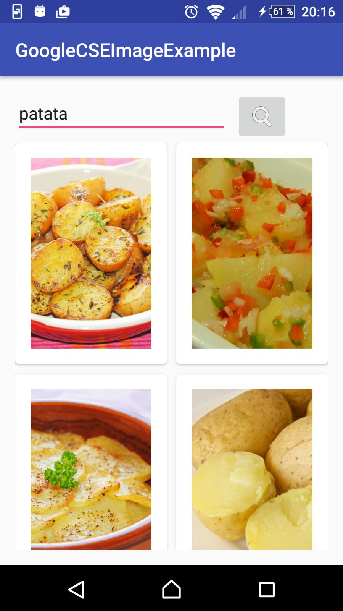

# SearchGoogleImages
Parse images from google custom search and show in a grid view

## GoogleSearchImageParser dependency
```gradle

repositories {
    maven { url 'https://github.com/anthorlop/mvn-android/raw/master/' }
}

// GoogleSearchImageParser gradle dependencies
compile 'es.lombrinus.projects.mods:GoogleSearchImageParser:1.0'
```

## Getting image items
```java

        GImageParser.get(q, API_KEY, SEARCH_CX, new GImageParserListener() {
            @Override
            public void onError(String error) {

                Toast.makeText(MainActivity.this, error, Toast.LENGTH_SHORT).show();
            }

            @Override
            public void onSuccess(List<Item> itemList) {

                mAdapter = new MainAdapter(MainActivity.this, itemList, MainActivity.this);

                mGrid.setAdapter(mAdapter);

            }
        });

```

## Required parameters

q: text to search

API_KEY: API Key from google Credentials

SEARCH_CX: Google Custom Search ID

## Optional parameters

#### size	
(unsigned integer)	Number of search results to return.
Valid values are integers between 1 and 10, inclusive.

#### start	
(unsigned integer)	The index of the first result to return.

#### siteSearch	
(string)	Specifies all search results should be pages from a given site.

#### imgColorType	
(string)	Returns black and white, grayscale, or color images: mono, gray, and color. 

Acceptable values are:
"color": color
"gray": gray
"mono": mono

#### imgDominantColor	
(string)	Returns images of a specific dominant color. 

Acceptable values are:
"black": black
"blue": blue
"brown": brown
"gray": gray
"green": green
"pink": pink
"purple": purple
"teal": teal
"white": white
"yellow": yellow

#### imgSize	
(string)	Returns images of a specified size. 

Acceptable values are:
"huge": huge
"icon": icon
"large": large
"medium": medium
"small": small
"xlarge": xlarge
"xxlarge": xxlarge

________________________________

You can generate your own Custom Search:
API KEY: https://console.developers.google.com/apis/credentials
SEARCH ID: https://cse.google.es/cse


